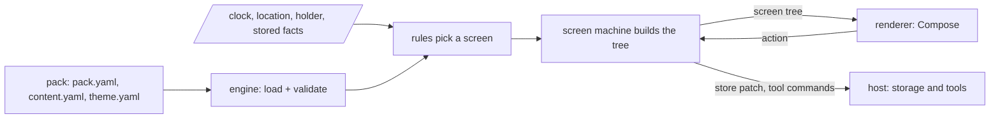

# deskpress

Your own app, printed from a few files.

deskpress is an open source, offline-first app that becomes whatever a pack describes. You (or your
LLM) write the pack in YAML, load it into the installed app, and that is the app now. No account, no
server, no code.

It exists because the apps that would answer a handful of personal questions are never worth
building one at a time: a trip, a hospital stay, a move, a season of a sport, a treatment schedule.
The work in each of them is the same work, and none of it is the content.

## How it works



A pack has three parts:

- **`pack.yaml`**, the definition: which screen shows when (rules), what each screen holds and what
  you can do on it, and which built-in modules it uses (timeline, places, people, choices, alerts,
  documents).
- **`content.yaml`**, the data: your days, places, people, in any language.
- **`theme.yaml`**, the design system: colors, type, spacing. The app has a section to see and edit
  it, and the edits are saved back to the file.

The app works like a state machine. The rules read the clock, where you are, who holds the phone and
what you have decided, and pick the screen. Each screen is a small machine of its own.

## Run it

The engine is Rust, loaded on the phone as a native library. Needs [rustup](https://rustup.rs),
GNU make, and for the app the Android SDK and Java 17 or newer. `make` lists every task.

```sh
make setup                               # the Rust targets, cargo tools, SDK parts and Maestro
make check                               # format, lint, tests with a 100% coverage gate
make install                             # then: deskpress validate examples/one-day
make run                                 # build the app, install it on a device and open it
make e2e                                 # the device regression flows
```

The app follows the example day: the list of days before it, the plan, the block happening now,
and its place a tap away. See the [roadmap](docs/roadmap.md).

## Where to read next

| document | what it covers |
| --- | --- |
| [docs/architecture.md](docs/architecture.md) | the engine, the two machines, the host, in diagrams |
| [docs/pack-format.md](docs/pack-format.md) | every key a pack can use |
| [docs/authoring.md](docs/authoring.md) | how to write a pack, by hand or with an LLM |
| [docs/glossary.md](docs/glossary.md) | the product's own words and the technical terms, in one line each |
| [docs/decisions/](docs/decisions/) | why things are the way they are |
| [docs/roadmap.md](docs/roadmap.md) | what is done and what is next |
| [examples/one-day/](examples/one-day/) | a whole pack, small enough to read in a minute |
| [skills/write-a-deskpress-pack/](skills/write-a-deskpress-pack/) | the skill an LLM loads before writing a pack |

## Status

Early. The data contract and the design system are measured against a real pack; the engine is
being built. The first pack in use is a private one, thirteen days of family travel.

## License

MIT. See [LICENSE](LICENSE).
