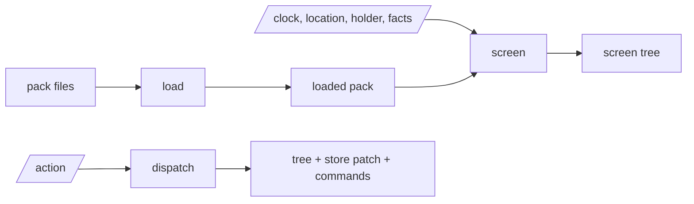

# deskpress-engine

The pure core: it turns a pack and the state of the world into a screen tree. Standard library
only; no clock, no files, no network. The host passes everything in.

| module | does |
| --- | --- |
| `yaml` | reads the YAML subset a pack is written in, refusing what it does not know |
| `pack` | loads a pack's files through a callback the host supplies |
| `define` | compiles the definition: modules, derive, rules and each screen's state, actions and layout |
| `engine` | `screen` and `dispatch`: the world in, the view and its watch out, and the nav stack |
| `modules` | what each module adds to the scope, and when its answer changes |
| `clock` | the pack-local minute: parsing, adding, comparing |
| `tree` | the screen tree a layout builds, and the outline of a pack with no rules |
| `validate` | lists every error and warning in a loaded pack |
| `share` | the trip sent phone to phone: what one phone sends, and what another takes of it |
| `expr` | parses and evaluates expressions and text templates |
| `value` | the value tree all of them share |

Tests: `make check` from the repo root, gated at 100% coverage.
