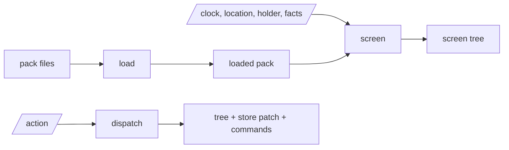

# deskpress-engine

The pure core: it turns a pack and the state of the world into a screen tree. Standard library
only; no clock, no files, no network. The host passes everything in.

| module | does |
| --- | --- |
| `yaml` | reads the YAML subset a pack is written in, refusing what it does not know |
| `pack` | loads a pack's files through a callback the host supplies |
| `validate` | lists every error and warning in a loaded pack |
| `expr` | parses and evaluates expressions and text templates |
| `value` | the value tree all of them share |

`screen` and `act` arrive in phase 3 of the [roadmap](../../docs/roadmap.md).

Tests: `make check` from the repo root, gated at 100% coverage.
