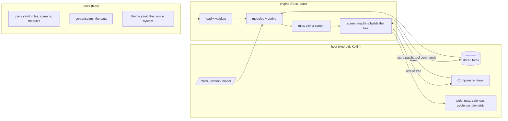
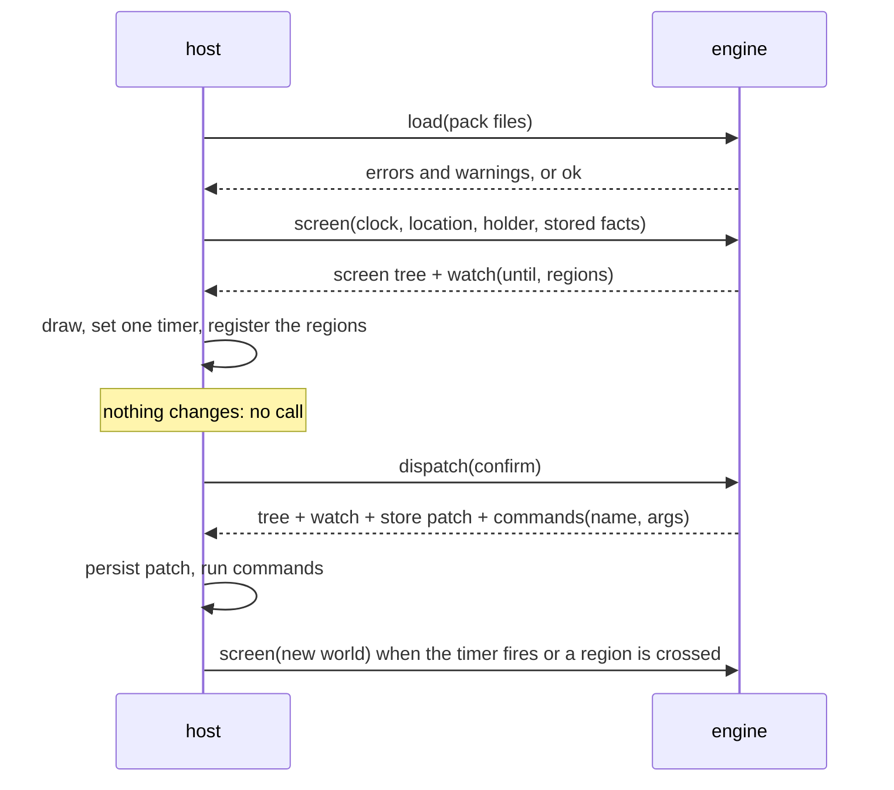

# Architecture

A pack describes an app. The **engine** turns the pack and the state of the world into a **screen
tree**. A **renderer** draws that tree with the pack's theme. Nothing else is involved: no server, no
account, and no network unless the pack asks for a sync.



## The engine

One Rust crate, standard library only. It never reads a clock, a file or a sensor: the host passes
everything in. That is what lets the same code run on a desk, in the app, and in an LLM plugin, and
what makes every behaviour a table test.

On the phone it is a native library: UniFFI generates the Kotlin types, so the host calls it like
any Kotlin API and gets a typed screen tree back. On the desk the `deskpress` binary prints the
same tree as JSON. See [decision 0010](decisions/0010-rust-core-uniffi.md).

Three calls:

| call | when | what it does |
| --- | --- | --- |
| `load(files)` | once per pack | parse YAML, merge the template it `extends` ([templates.md](templates.md)), apply the keymap, validate everything, compile expressions. Returns errors and warnings, or a loaded pack |
| `screen(world)` | only when an input changes or `watch.until` is reached | run the modules, the derived values and the rules; build the screen tree and its `watch` |
| `dispatch(world, action, arg)` | on a tap | run the action's effects; return the new tree and its `watch`, a store patch and tool commands for the host |



Same world, same tree: the host never calls the engine to find out that nothing changed. The
`watch` says what would change the answer (the next instant, the geofences that matter), so the
host waits on one timer instead of polling. See [decision 0013](decisions/0013-call-only-on-change.md).

The world is four things: the local time in the pack's timezone as `YYYY-MM-DDTHH:MM`, with the
local time of each other zone the days name (the host converts, so the engine carries no
timezone database), the ids of the places whose region the
device is inside (never coordinates) and whether it knows where it is, who holds the phone, and
the stored facts. The regions come from the pack: `watch` carries each place's circle, and the host
works out which it is inside.

### Two machines

- **The main machine** is the pack's `rules`: ordered guards, first true wins, the last one has no
  guard. It answers "which screen, right now". Any change of input re-runs it.
- **A screen machine** is a screen's `state`, `actions` and `layout`. It answers "what can happen
  here". An action can `store` a fact, which is an input, so it can move the main machine.

The screens a user opened sit on a nav stack. It starts at the screen the rules picked and is
reset when the rules pick another; `open` pushes, `back` pops, `home` leaves only the first. The
loaded pack keeps the stack between calls.

The details, and why, are in [decision 0002](decisions/0002-main-machine-and-screen-machines.md).

### Modules

Shared, tested domain logic that a pack opts into: `timeline` (which day, which block), `places`
(which place, geofences), `people` (who holds the phone), `choices` (stored decisions), `alerts`,
`documents`, `climate` (the weather here, today), `sheets` (reference tables). Each exposes names to expressions and may ask the host for tools. A module mixes
two inputs: its data, which the pack says where to take from (the pack, a sync, or both), and the
world, which the host pushes in and the module's code decides which parts it reads. See
[decision 0004](decisions/0004-modules-and-derive.md).

### Expressions

`when: decision.due and not decision.answered`. A small grammar, parsed at load, never evaluated as
code. A typo is a load error with a path and a column. See [decision 0003](decisions/0003-expression-language.md).

## Patterns

Not MVVM: the logic is not in the app's view models, it is in the engine and the pack.

| pattern | where | why |
| --- | --- | --- |
| functional core, imperative shell | the engine is pure; the host does all I/O | every behaviour is a table test, the same on phone, desk and plugin |
| unidirectional data flow (Elm, MVI) | world → `screen` → tree; tap → `dispatch` → tree | one source of truth; Compose redraws whatever tree it gets |
| reducer with effects as data (like TCA) | `dispatch` returns a store patch and tool commands; the host runs them | the engine describes side effects, never performs them |
| two level state machines (statecharts) | `rules` pick the screen; each screen has `state` + `actions` | "which screen now" is a pure function of the inputs; both levels are readable YAML |
| data driven UI, on the device | the engine emits a tree of known components | the renderer knows components and tokens, never packs |
| interpreter | the expression grammar, parsed at load | a pack is data, never code |
| ports and adapters | modules behind one interface; host tools behind commands | new domain logic or a new platform without touching the core |
| design tokens | the theme is data; components read tokens | theme editing and write back work without code |

On Android there is one thin view model: it holds the engine, turns device events into calls
and exposes the current tree to Compose. It holds no business logic.

## The screen tree

The contract between engine and renderer. Plain data, versioned, and the same on every platform.

```json
{
  "version": 4,
  "screen": "moment",
  "theme": "rita-light",
  "kid": false,
  "nodes": [
    { "kind": "BigValue", "props": { "text": "11:15", "caption": "Tile museum, top floor first" }, "on": {}, "children": [] },
    { "kind": "Button", "props": { "label": "Point by point" }, "on": { "tap": "points" }, "children": [] }
  ]
}
```

A prop is any value: text, a number, a list or a mapping. `on` maps an event to an action of the
screen; the host sends that name back through `dispatch`, with the node's `value` prop as `$arg`.
`children` are the nodes a `Group` holds; every other kind has none.
`theme` is the theme id of the person holding the phone (empty for the pack's default) and `kid`
says a child holds it, so the renderer switches to kid type, borders and boxes.

Next to the tree, the engine returns `watch: {until, regions}` for the host, not the renderer. The
renderer keeps the current tree on screen until a different one arrives, so a call never flickers.

A renderer knows the closed set of components and the theme tokens, and nothing about packs.

## The theme

Data: named tokens for color, type, spacing and radius, one theme per person and mode if the pack
wants it. Components read tokens and never branch on a theme name. Contrast is checked at load and
on every edit: 4.5:1 or refused.

The app's design system section shows every token and component of the loaded theme, lets you edit
them, and writes the edit back to the theme file. The engine makes the edit in the file's text and
checks the whole pack with it; the host only writes what it gets back. See
[decision 0006](decisions/0006-theme-edits-write-back.md) and [0016](decisions/0016-theme-editor.md).

## The host

Everything that touches the device lives here, in Kotlin: reading and writing the picked files,
loading the engine through UniFFI, feeding it the clock and location, persisting stored facts, and
the tools: open a map, sync a calendar, fetch a module's data, watch geofences, unlock with a fingerprint, dial a
number, show a pack file full screen. For a calendar sync the engine says what the events are
and what changed against what the host wrote before; the host writes only its own rows. See
[decision 0021](decisions/0021-calendar.md).

## Offline first

The pack is a file on the device. The engine and the validator are local. With no `sync` in the
pack, nothing the app does reaches the network itself: opening a map hands the place to a map app,
and a calendar sync writes into an account calendar the phone syncs on its own.

A module can also sync its data, if the pack says so: by button or automatically, over the pack's
own data or instead of it. The person approves the hosts once, a failed sync keeps the last good
data with its age, and no secret lives in the pack. The engine builds each request and reads each
reply; the host only makes the HTTPS `GET`, and only while the app is open. See
[decision 0012](decisions/0012-data-sources-and-sync.md) and [0022](decisions/0022-data-sync.md).
