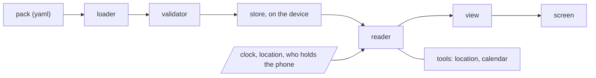

# Architecture

The whole shell in one sentence: **a screen is a view applied to a moment and a user.**

```
screen = view(moment, user)
moment = (day, time) + place
user   = who is holding the phone + theme + mode
```

Everything below is the machinery that makes that sentence true, and the reason the app stays small.



## The loader

Reads the pack from a file the person picked, parses the YAML, applies the manifest's `keymap` so
every key is canonical from that point on, resolves path references, and hands a plain tree to the
validator. It runs once per load, not per screen.

Two things it does that matter later:

- **Keymap first, everything else after.** No other part of the shell knows that a pack might use
  `dias` instead of `days`. The keymap is applied in the loader and nowhere else.
- **References resolved eagerly.** `bookings.azulejo` becomes the record it points at before
  any reader or view sees it. A reference that does not resolve stays as its own text, so a typo
  degrades into a visible string instead of a crash.

## The validator

`tools/validate.mjs`, plain ES modules with no dependencies, which is the point: **the same file
runs on a desk with node and inside the app**. A pack that passes on the desk passes on the phone,
so the person who wrote it never finds out at an airport that it was malformed.

What it checks, in order, and it reports every failure rather than stopping at the first:

1. **Skeleton.** The manifest has `id`, `name`, `language`, `timezone`, `content`. The content has
   `days`. Ids are slugs and unique inside their collection.
2. **Formats.** Dates are `YYYY-MM-DD` and real. Times are `HH:MM` on a 24 hour clock. Timestamps
   are `YYYY-MM-DDTHH:MM`. The timezone is an IANA name.
3. **Block shape.** Every block is a list of two or three elements: a time, a text, and an optional
   map. A third element that is not a map is the single most common authoring mistake, so its
   message says exactly that.
4. **Types.** Every `type` is one of the thirteen. A near miss reports the closest valid value.
5. **References.** Every `place`, `for`, `guide`, `see` and path reference resolves. Every
   `requires` names a date that exists and an option id that exists on it.
6. **Option days.** A day with `options` has at least two, at most one `recommended`, unique ids,
   and a `decision.when` that falls before the day itself.
7. **Theme.** All 23 tokens are present in every declared theme, and the 13 contrast pairs clear
   4.5:1. A theme that fails is not a matter of taste: it is text nobody can read in the sun.

Severity is two levels. **Errors** block the load: the app will not pretend. **Warnings** load and
show a line on the validator screen: a place with no coordinates, a fact whose `verified` date is
over a month old, a day with no blocks, a point with no `for_kids` when a kid is declared.

In app, the same code drives a screen: pick the file, see what is wrong in plain words with the key
path that caused it, fix it, load again.

## The reader

The reader is the only place in the app that makes a decision. It answers one question, **what
should be on the screen right now**, and returns one plain object.

Its inputs are the store, the clock, the current place (from the location tool, or the last known
one), and who is holding the phone. Its output names a view and carries everything that view needs:
no lazy lookups, no callbacks back into the store.

The rules, in the order they run:

1. If a decision is due and unanswered, the answer is the **suggestion** view. A question the person
   has to settle outranks anything they were about to read.
2. If a `critical` alert is live for this moment, it rides along at the top. It does not replace the
   screen; it sits above the answer.
3. Find the current block: the last block whose time has passed, on today's day entry, in the pack's
   timezone. On an option day, from `fixed` plus the chosen option, or the recommended one if
   nothing was chosen.
4. If that block names a place, and the location tool disagrees about which place we are at, prefer
   the geofence. The phone knows where it is better than the plan does.
5. If the block is `locked` and its time has passed while we are somewhere else, the answer is the
   **blocker** view: one thing has gone wrong and it is the only thing on the screen.
6. Otherwise the answer is the **moment** view, built from the block, its place's `during`, and its
   unknown keys.

What the reader never does: measure anything, know a color, know a font size, or decide what a card
looks like. That is the split the whole codebase rests on, and it is what keeps the app cheap to
change.

## The six views

A view draws one object. It has no business logic, and it does not fetch.

| view | the question it answers |
| --- | --- |
| `moment` | what is happening now |
| `sheet` | the detail behind it: a list, a table, a document |
| `agenda` | the shape of the day, and the only way back |
| `suggestion` | a decision that is due, with its options side by side |
| `blocker` | one thing has gone wrong, and here is what to do |
| `handoff` | who is holding the phone |

Forty four screens drawn on paper collapsed into these six, because what repeats in a life repeats
on a screen. A seventh view means something was misread: look for the moment whose data is
different, not for a new layout.

## Twelve components

`Screen`, `Button`, `Card`, `Label`, `BigValue`, `Row`, `PhraseRow`, `Alert`, `Chip`, `Segmented`,
`Missing`, `KidBox`.

Rules that are worth more than the list:

- **One question per screen.** The answer is at the top at 64px, in `BigValue`. Everything else
  backs it up. Two answers means two moments.
- **No menu, no home, no loose back button.** The only way out of any screen is Today.
- **`Missing` is a component on purpose.** A fact nobody has confirmed renders as a striped hole
  with `[to confirm]` in it. An invented price is worse than a hole.
- **`KidBox` is `Card` with an attribute**, not a second component and not a second app.

## The theme engine

A theme is data: 23 semantic tokens, and no component ever branches on a theme name. The reference
pack declares eight themes, one per person times light and dark, which is normal here rather than
an edge case: the phone is handed around, and each person gets their own.

Kid mode is an attribute on the screen, not a theme and not a mode flag threaded through every
component: larger type, thicker borders, `Card` becomes `KidBox`, and content is filtered to what
was written for a kid. The radius stays 28px in both modes, because rounding things more for
children is decoration, not legibility.

The validator's contrast check is part of the engine, not an optional lint. Thirteen pairs at 4.5:1,
measured, because this app gets read outdoors in October sun with one hand.

## The two tools

Everything else in the app is pure. Exactly two pieces touch the OS.

**Location.** Places that declare `at: {lat, lon, radius_m}` become geofences. Three jobs and no
fourth: tell which place we are actually at when the plan is ambiguous, know whether the current
place is `safe` so a kid session may start, and remember where the car was left. Geofences are an OS
API, the coordinates came from the pack, and nothing is reported anywhere. There is no tracking
because there is nobody to track for.

**Calendar sync.** A tool the person runs, not a service that runs itself. It writes timed blocks
into a device calendar named after the pack, with event ids derived from `pack.id`, the date and the
block time, so syncing twice updates instead of duplicating. On option days it writes `fixed` blocks
only; the chosen option's blocks go in when the choice is made, and the previous option's events are
removed. That removal is the only thing the app ever deletes from a calendar.

## Offline first, not offline capable

There is no cache to warm and no request to retry, because there was never a request. The pack is a
file on the device, the validator is local, the themes are local, the geofences are local. The only
thing that reaches the network is opening a map, and where there is no signal that button shows the
address as selectable text instead.

This is the constraint that keeps the rest honest: nothing in the architecture above can quietly
grow a server behind it.
