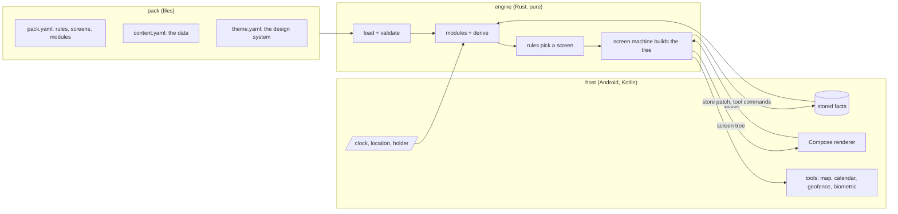
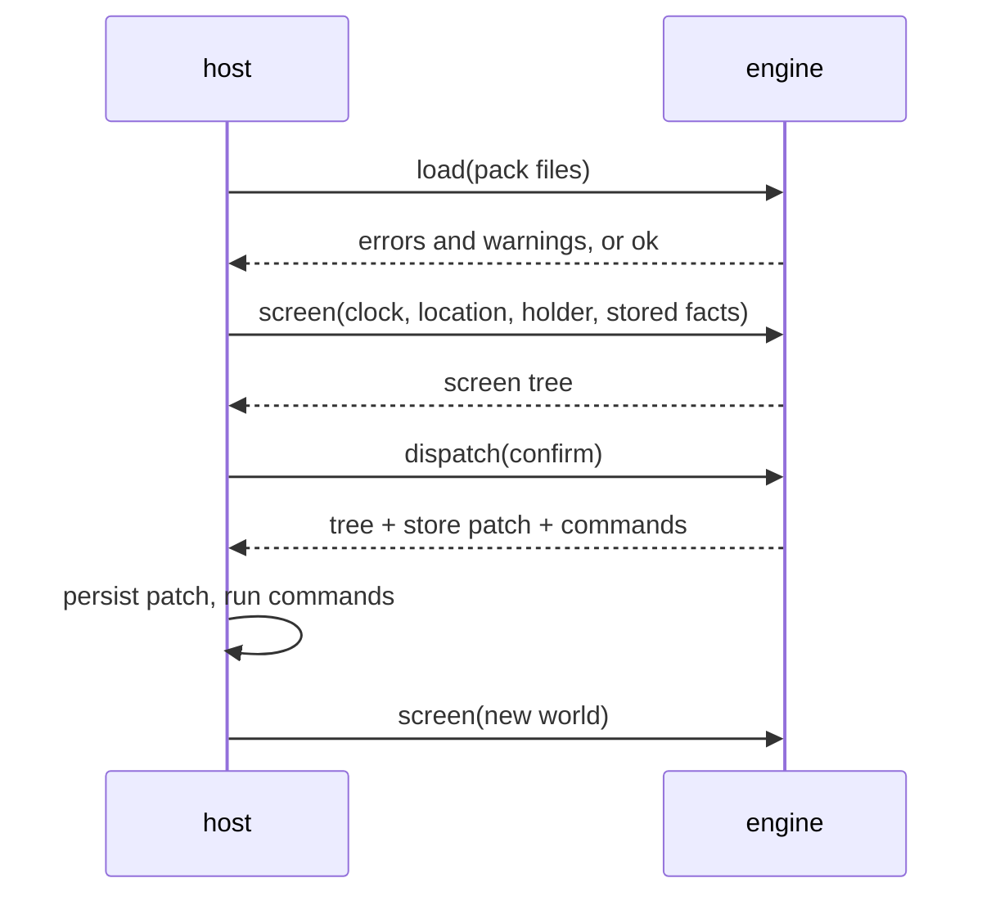

# Architecture

A pack describes an app. The **engine** turns the pack and the state of the world into a **screen
tree**. A **renderer** draws that tree with the pack's theme. Nothing else is involved: no server, no
account, no network.



## The engine

One Rust crate, standard library only. It never reads a clock, a file or a sensor: the host passes
everything in. That is what lets the same code run on a desk, in the app, and in an LLM plugin, and
what makes every behaviour a table test.

On the phone it is a native library: UniFFI generates the Kotlin types, so the host calls it like
any Kotlin API and gets a typed screen tree back. On the desk the `deskpress` binary prints the
same tree as JSON. See [decision 0010](decisions/0010-rust-core-uniffi.md).

Three calls:

| call | when | what it does |
| --- | --- | --- |
| `load(files)` | once per pack | parse YAML, apply the keymap, validate everything, compile expressions. Returns errors and warnings, or a loaded pack |
| `screen(world)` | on every event | run the modules, the derived values and the rules; build the screen tree |
| `dispatch(action)` | on a tap | run the action's effects; return the new tree, a store patch and tool commands for the host |



### Two machines

- **The main machine** is the pack's `rules`: ordered guards, first true wins, the last one has no
  guard. It answers "which screen, right now". Any change of input re-runs it.
- **A screen machine** is a screen's `state`, `actions` and `layout`. It answers "what can happen
  here". An action can `store` a fact, which is an input, so it can move the main machine.

The details, and why, are in [decision 0002](decisions/0002-main-machine-and-screen-machines.md).

### Modules

Shared, tested domain logic that a pack opts into: `timeline` (which day, which block), `places`
(which place, geofences), `people` (who holds the phone), `choices` (stored decisions), `alerts`,
`documents`. Each exposes names to expressions and may ask the host for tools. See
[decision 0004](decisions/0004-modules-and-derive.md).

### Expressions

`when: decision.due and not decision.answered`. A small grammar, parsed at load, never evaluated as
code. A typo is a load error with a path and a column. See [decision 0003](decisions/0003-expression-language.md).

## Patterns

Not MVVM: the logic is not in the app's view models, it is in the engine and the pack.

| pattern | where | why |
| --- | --- | --- |
| functional core, imperative shell | the engine is pure; the host does all I/O | every behaviour is a table test, the same on phone, desk and plugin |
| unidirectional data flow (Elm, MVI) | world → `screen` → tree; tap → `dispatch` → tree | one source of truth; Compose redraws whatever tree it gets |
| reducer with effects as data (like TCA) | `dispatch` returns a store patch and tool commands; the host runs them | the engine describes side effects, never performs them |
| two level state machines (statecharts) | `rules` pick the screen; each screen has `state` + `actions` | "which screen now" is a pure function of the inputs; both levels are readable YAML |
| data driven UI, on the device | the engine emits a tree of known components | the renderer knows components and tokens, never packs |
| interpreter | the expression grammar, parsed at load | a pack is data, never code |
| ports and adapters | modules behind one interface; host tools behind commands | new domain logic or a new platform without touching the core |
| design tokens | the theme is data; components read tokens | theme editing and write back work without code |

On Android there is one thin view model: it holds the engine, turns device events into calls
and exposes the current tree to Compose. It holds no business logic.

## The screen tree

The contract between engine and renderer. Plain data, versioned, and the same on every platform.

```json
{
  "version": 1,
  "screen": "moment",
  "theme": "rita-light",
  "kid": false,
  "nodes": [
    { "type": "BigValue", "props": { "text": "11:15", "caption": "Tile museum, top floor first" } },
    { "type": "Button", "props": { "label": "Open in map" }, "on": { "tap": "open_map" } }
  ]
}
```

A renderer knows the closed set of components and the theme tokens, and nothing about packs.

## The theme

Data: named tokens for color, type, spacing and radius, one theme per person and mode if the pack
wants it. Components read tokens and never branch on a theme name. Contrast is checked at load and
on every edit: 4.5:1 or refused.

The app's design system section shows every token and component of the loaded theme, lets you edit
them, and writes the edit back to the theme file. See [decision 0006](decisions/0006-theme-edits-write-back.md).

## The host

Everything that touches the device lives here, in Kotlin: reading and writing the picked files,
loading the engine through UniFFI, feeding it the clock and location, persisting stored facts, and
the tools: open a map, sync a calendar, watch geofences, unlock with a fingerprint.

## Offline first

The pack is a file on the device. The engine and the validator are local. The only thing that can
reach the network is opening a map, and without signal that button shows the address as text.
