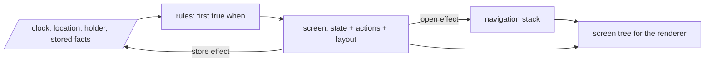

# 0002: A guarded rule table picks the screen; each screen is its own machine

Status: accepted, 2026-09-26.

## Context

The app has no menu: the situation decides what is on the screen. That has to be data in the pack,
not code in the shell, or every new kind of app needs a release. It also has to be predictable,
because a person reads it outdoors at the worst moment, and testable, because a wrong screen at an
airport is the failure this project exists to prevent.

## Decision

Two levels of machine.

**The main machine** is finite. The pack lists `rules`, in order, each a `when` guard and a
`screen`. The first rule whose guard is true names the screen. The last rule has no guard, so
there is always an answer. The inputs are the world the host passes in (clock, location, who holds
the phone) plus what is stored on the device (choices, a parked car). An event is any change of
input; the engine re-evaluates the table and nothing else.

**A screen machine** is an extended state machine, unbounded in the values it holds. A screen
declares local `state` and named `actions`; an action is a short list of effects (`set`, `store`,
`open`, `back`, `home`, or a module action like `calendar.sync`), each optionally guarded by `if`.
Its `layout` binds components to expressions and to actions.

Two rules keep the levels from fighting:

- `open` pushes a screen onto a stack; `back` pops; `home` clears it. The stack is cleared when the
  rule table picks a **different** screen name, because the situation changed and it outranks
  whatever the person was reading.
- A screen's local `state` resets when the screen leaves the top of the stack. Anything that must
  survive is written with `store`, which is an input, so the main machine sees it.

## Consequences

- The screen is a pure function of inputs, stack and local state. Every test is a table of inputs
  and an expected screen.
- No hidden history, no timers inside the engine. The host decides when to re-evaluate: every
  minute, on a location update, on a handoff, after a `store`.
- Multi step flows are expressed as screen state plus `open`, not as nested machines. If a real
  pack needs more, that is a new decision.
