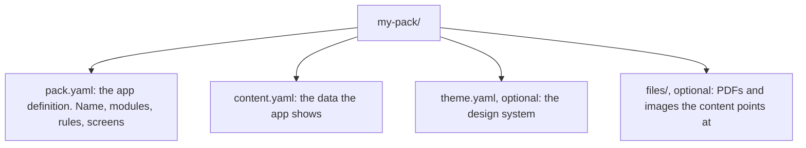

# Pack format

A pack is a folder of three parts. The shell loads it, validates it, and becomes the app it
describes.



This page has two halves. **The definition** (modules, rules, screens, expressions) is what the
engine runs; it follows decisions 0002 to 0005. **The content** (days, places, people, alerts,
documents, climate, sheets) is what the modules read.

Two rules before the keys.

**Canonical keys are English; values are free.** The shell reads `days`, `blocks`, `places`,
`people`. What those keys hold can be in any language and any script, and the shell never parses
your prose: it places it. If your file already uses key names in another language, do not rewrite
it; declare a `keymap` in the manifest. The keymap is grouped by context (`day`, `option`, `place`,
`point`, `alert`, and so on), because the same canonical key has different names in different
places: `why` is `por_que` in an option and `por_que_importa` in a point.

**Unknown keys render, they do not break.** Any key the shell does not know becomes a card labelled
with the key name, underscores turned into spaces, holding its value. That is the feature that lets
you enrich a pack tonight and see it on the phone tomorrow without anyone writing code.

## pack.yaml

```yaml
pack:
  id: ruta-2027               # slug. Stable forever: the facts and calendar events kept are filed under it
  name: Mi ruta               # what the app calls itself once this pack is loaded
  language: es                # BCP 47. Picks the shell's own handful of labels
  timezone: Europe/Lisbon     # IANA. The moment is computed in this zone
  content: content.yaml       # one file, a list merged in order, or a root to file map
  theme: theme.yaml           # optional. Without it the shell uses its default theme
  files: files/               # optional. Base for every file reference
  extends: travel             # optional. Starts from a bundled template (docs/templates.md)

conventions:                  # optional, all of it
  alert_prefixes: [warn, alert]   # keys starting with these render as an Alert, not a Card
  hidden_prefixes: [source]       # keys that carry provenance and never reach a screen

keymap:                       # optional. canonical key -> the name this pack uses, by context
  root:
    days: itinerario.dias     # under root, a dotted path is allowed
    places: lugares
    people: viajeros
  day: {date: fecha, title: titulo, blocks: bloques, fixed: fijo_del_dia, options: opciones}
  point: {name: nombre, what: que_es, why: por_que_importa, for_kids: para_los_ninos}
  values:
    severity: {critical: critica, high: alta, medium: media, low: baja}

ui:                           # optional. overrides the shell's own labels
  today: Hoy
  back: Volver
  next: Lo que sigue
  open_map: Abrir en el mapa
```

**`content` takes three forms.** One file name. A list of file names, merged in order, which is
refused when two of them define the same root key, because the second one would quietly win. Or a
map from root key to the file that holds it, which is the form to use once a pack is split: each
file is rooted under the key that names it, so two files cannot collide.

```yaml
pack:
  content:
    days: days.yaml           # days.yaml holds the list itself, with no "days:" line above it
    places: places.yaml
```

Those keys go through `keymap.root` like any other, so a pack that calls its days something else
names them that way here too.

## The definition

The rest of `pack.yaml` says how the app behaves: which modules read the content, which
screen shows when, and what can happen on each screen. A pack may also start from a template with
`pack.extends: travel` and only override what differs: `modules`, `derive`, `questions`, `screens` and `ui`
merge by key, the pack's entry winning; the pack's `rules` are tried before the template's; any
other section replaces the template's. See [templates.md](templates.md).

```yaml
modules:                      # shared logic the pack opts into. Empty reads its own root
  timeline:
  choices:
  people:
  places:   {from: lugares}   # or name the content root it reads

derive:                       # further names, in order, each from an expression
  kid: holder.adult == false

rules:                        # the main machine: first true `when` picks the screen
  - when: decision.due and not decision.answered
    screen: choose_day
  - when: block.locked and block.missed
    screen: blocker
  - screen: moment            # the last rule has no `when`

screens:                      # each screen is its own machine
  choose_day:
    state: {picked: null}     # local, reset when the screen leaves the top
    actions:
      pick:    [{set: picked, to: $arg}]
      confirm:
        - {if: picked, store: "choice.{day.date}", value: picked}
        - calendar.sync
    layout:
      - BigValue: {text: decision.question}
      - Segmented: {items: day.options, on_tap: pick}
      - Button: {label: ui.confirm, on_tap: confirm}
```

### Where a module's data comes from

A module reads the pack's content (`from`), a source it syncs (`sync`), or both. Synced data wins
where it covers and the pack fills the rest; a failed sync keeps the last good data and its age.

```yaml
modules:
  climate:
    from: climate
    sync: {trigger: button, request: {url: "https://api.example.org/forecast"}}
```

| mode | `from` | `sync.trigger` |
| --- | --- | --- |
| on the pack | yes | none |
| pack, plus a sync button | yes | `button` |
| sync button only | none | `button` |
| pack, plus auto sync | yes | `auto`, with `every: 6h` |
| auto sync only | none | `auto`, with `every` |

A module with neither reads the pack under its own root: `timeline` and `choices` read `days`,
the others the root named like them. Field names come through the `keymap`, never through module
settings. With a `sync` and no `from`, the module reads nothing from the pack. Only `climate`
syncs so far; see [decision 0022](decisions/0022-data-sync.md).

```yaml
modules:
  climate:
    from: climate
    sync:
      trigger: auto
      every: 6h                                  # m, h or d; at least 15m. auto only
      request:
        url: "https://api.example.org/forecast?units=metric"
        query: {lat: place.at.lat, lon: place.at.lon, day: now.date}
        secret: {name: forecast_key, param: key}
      tag: {place: place.id}
      read: {date: daily.time, high: daily.max, low: daily.min, summary: daily.text}
```

| key | what it is |
| --- | --- |
| `trigger` | `button`: the action `climate.sync` fetches. `auto`: also whenever it falls due while the app is open |
| `every` | how long a good reply lasts. A failed try waits 15 minutes before the next |
| `request.url` | an `https://` address. The person approves its host once per pack before the first fetch |
| `request.query` | parameters from expressions, percent-encoded. One with no value, say with no place, skips the fetch |
| `request.secret` | `name` is asked on the device the first time and kept there sealed, never in the pack, and sent only to the host it was given for; it goes in the query parameter `param`. The server answering 401 or 403 forgets it |
| `tag` | row keys set from expressions on every row read, like the place the request was for |
| `read` | row keys (the ones of `climate.entries`) to dotted paths in the JSON reply. A path that finds a list gives one row per item; one that finds a single value gives it to every row |

A reply is kept whole, as the rows it read, and replaces the last one. Synced rows rank like the
pack's entries and win a tie. A `sunrise` or `sunset` sent as a timestamp is cut to its `HH:MM`.

### What the modules expose

They run in this order, and each reads what the ones before it exposed. Every mapping comes out
with canonical keys, whatever the pack calls them.

| module | names | what they hold |
| --- | --- | --- |
| `timeline` | `day`, `block`, `next`, `days`, `tomorrow` | today's day with its blocks in force, its `choice`, `started` (a timed block has begun) and `time` (the time on the day's own clock); the last block whose time has come, until its `until`; the first one still to come; every day; the day after today, with `first`, its first timed block. A block is `{time, text, state, event, ...its map}`, where `event` is its calendar id, `{date}.{list}.{n}`: the list is `blocks`, `fixed`, `option-{id}` or `added`, and `n` its place in that list. The day is then rebuilt from the device's own edits, `plan.<event>` and `added.<date>` |
| `choices` | `decision` | the first decision due and unanswered, else the first one due, else the next one coming: `{date, title, options, recommended, choice, due, answered}` plus the decision's own keys. Due from `when` at `at` until its day is over |
| `people` | `holder`, `people` | the person holding the phone (the host's, else the one stored as `holder`; a valid stamp stored as `holder_until` sets the watch until it runs out), and everyone |
| `places` | `place`, `here`, `away`, `chart`, `area` | where the current block happens; the place the device is inside, the block's own when it is one of them, else the smallest; and whether the device knows where it is and is out of the block place's region. Both places carry their `id` ([decision 0020](decisions/0020-location.md)). `chart` is the day on plain paper: `{points, path, route, span_m}`, `route` being every stop in order as `{lat, lon, name}`, null when no place the day names has an `at` ([decision 0026](decisions/0026-maps.md)). `area` is the block's place up close: its points that have an `at`, charted the same way, `path` and `route` empty unless the place is `in_order`, null when none has one ([decision 0031](decisions/0031-maps-to-guide-by.md)) |
| `alerts` | `alerts` | the ones showing now, most severe first: from `notify_from` (else the start of their day) to the end of their day |
| `documents` | `documents` | all of them, each with `person` (the name of its `for`, from the `people` module listed before it) and `call` as `[{label, number}]`. None when a child holds the phone |
| `climate` | `weather` | the weather for today at `place`, else `here` |
| `sheets` | `sheets` | every tree under `sheets` as `{id, title, value}`, the title the key with `_` as spaces; with no `sheets` root, every root key no other module reads. A sheet saying `check: true` also gets `ticks`, one `{fact, text, done}` per item, and keeps `check` and `items` out of `value` |

A block's `state` is `note` (no time), `now`, `past`, `locked`, or `next` (still to come), for
the agenda. A block's `type` comes out canonical through `keymap.values.type`, and a place's
`during`, `parking` and `points`, wherever the points sit, through their keymap contexts.

A day with options runs its `fixed` blocks and the chosen option's, in time order. The choice in
force is the one stored as `choice.<date>`, else the recommended one, else the first. A block with
a `for` that does not name the person holding the phone is left out of the day.

Each day runs on its own clock when it names a `zone` (see [days](#days)): today is the first day
whose date is the date there, and a block has begun when its time there has come. The host passes
the local time of each zone the pack names (`Engine::zones`), so the engine needs no zone rules.

### Questions

What the pack can answer about itself, keyed by id. Read after `derive` and before the rules, so an
answer sees everything a screen sees ([decision 0027](decisions/0027-the-assistant.md)).

```yaml
questions:
  now:
    ask: {en: What is happening now?, pt: O que esta acontecendo agora?}
    answer: "{block.time} {block.text}"
    shortcut: true
  toilets:
    ask: Where are the toilets?
    answer: place.toilets
    when: place.toilets
```

| key | what it is |
| --- | --- |
| `ask` | the words the person would say: one text, or one per language tag |
| `answer` | an expression, or a text with `{expr}` pieces, exactly as a screen's prop is |
| `when` | offered only while this holds. Absent means always |
| `shortcut` | offer it to the phone's launcher and assistant too. Absent means no |

The screen reads `questions`, a list of `{id, ask, answer, shortcut}` already answered, and a
question whose `when` is false is not in it. The words are the first language the question speaks
of the holder's and then the pack's, matching `pt-BR` to `pt`, falling back to the text a pack with
one language wrote. `questions` merges by key like `ui`, so a pack extending a template replaces
one question and keeps the rest.

### Rules

An ordered list. Each rule has a `screen` and, except the last, a `when`. The engine re-runs the
list whenever an input changes. When the chosen screen's name changes, the navigation stack is
cleared: the situation outranks what the person was reading. A pack with no `rules` shows the
outline: its name, then one row per day.

### Screens

| key | what it is |
| --- | --- |
| `state` | local values with their starting value, as literals. Reset when the screen leaves the top of the stack. A name may not hide a name the scope already has |
| `actions` | named lists of effects, run in order |
| `layout` | a list of components, each bound to expressions and actions |

Effects:

| effect | what it does |
| --- | --- |
| `{set: name, to: expr}` | change a local state value of this screen |
| `{store: key, value: expr}` | persist a fact on the device. The key is a text template, like `seen.{now.date}`. Stored facts are inputs, so this can change the screen |
| `{open: screen, with: {name: expr}}` | push a screen, passing values it reads as `params` |
| `back`, `home` | pop one screen, or clear the stack |
| `module.action` | a module's action, like `calendar.sync` or `map.open`. Goes to the host as a command |
| `{do: module.action, with: {key: expr}}` | the same, in mapping form, so it can take an `if` and pass values to the host command |

The `timeline` actions are the exception: the engine answers them itself, as stored facts, and no
command reaches the host ([decision 0025](decisions/0025-the-day-in-hand.md)). `timeline.move` and
`timeline.grow` take `{block, by}`, an `event` id and whole minutes, and shift or stretch it;
`timeline.swap` takes `{block, side}`, `'up'` or `'down'`, and gives each of the two the other's
hour; `timeline.drop` and `timeline.restore` take `{block}`; `timeline.add` takes `{date, time,
text}`. Arguments that make no sense write nothing.

The commands the Android host runs: `device.unlock` (asks for the fingerprint or the device
credential, then runs the action named in `then`), `phone.call` (opens the dialer with `number`),
`document.open` (shows the pack's `file` full screen under `title`), `location.get` (runs the
action named in `then` with the device's position as `$arg`, `{lat, lon}`), `map.open` (a map
app at `lat`, `lon`, pinned with `label`), `map.route` (the `stops`, a list of `{lat, lon, name}`,
in order as directions; the navigator named in Settings when it takes the link, else whatever the
phone offers), `climate.sync` (fetches the module's `sync` now,
decision 0022) and `calendar.sync` (writes the events within `scope`,
an event id, a date, or the whole trip when left out, into a calendar the person picks once per
pack, after showing what it would add, change and remove; decision 0021). `assistant.ask` takes
`question` and `facts` and runs the action named in `then` with the model's words as `$arg`: empty
on a phone with no model of its own, and empty when it fails, so the pack shows nothing. The orders
are the host's and the pack's facts go under them as data, never as part of them
([decision 0027](decisions/0027-the-assistant.md)).

Any mapping effect takes `if: expr` and is skipped when it is false. `$arg` is the value the
component sent: any component with an `on_tap` sends its `value` prop. After the effects run, the rules decide again
with the stored facts, so a `store` can move the app to another screen.

### Components

The closed set a layout can use. Every prop takes an expression, and a YAML list is taken as it
is written, like `skip: [time, text]`; colors, sizes and fonts come from the theme and cannot be
set here.

| component | what it draws |
| --- | --- |
| `BigValue` | the answer, at the top, large |
| `Label` | a line of small text |
| `Card` | a titled box with a body; `kid: true` in kid mode becomes a kid box |
| `Row` | `text` and `caption`, with `time` in a fixed column; `state` (a block's `now`, `past`, `locked`, or `picked`) tints it |
| `PhraseRow` | `text` (the phrase there) in bold, its `translation`, and a `hint` above the phrase |
| `Alert` | a warning, by severity |
| `Chip` | a small tag |
| `Button` | an action |
| `Segmented` | two or three `items` of equal width; the one equal to `value` is filled, and a tap sends its item |
| `Check` | a line to tick off: `text`, and `checked` for the box. A tap sends its `value` |
| `Field` | a line to type on: `label` above, `hint` when empty; every keystroke sends the typed text as `on_change` |
| `Map` | pins at their fractions of a drawing: `points` as `{name, x, y, lat, lon, state}` with `x` and `y` from 0 to 1 and `lat` and `lon` optional, `path` joining them in order, `image` a picture the pack carries, `caption`, and `span` metres as a scale line. When the pins carry `lat` and `lon`, a tap opens them on a real map, full screen, in the card's words: `open` for the link and the title, `pick` before a pin is picked, `follow`, and `unplaced` when the phone has no position; English when left out |
| `Missing` | a fact nobody confirmed, drawn as a striped hole |
| `Auto` | expands a mapping by the unknown key rule, one node per key; a list is a `Card` per item, and any other value one `Card`. `skip: [keys]` leaves keys out |
| `Group` | a titled box around the components in its own `layout`; left out when nothing inside is drawn |
| `Dialog` | `title` small and `text` large, over the screen, with `close` as the button's label; closing it sends `on_close`, which it needs. Give it an `if`, or it never goes |
| `Screen` | the frame: `title` in the top bar, `on_back` as a round button, every other `on_<event>` as a pill labelled by the prop of that name; `foot_label`, `foot_time` and `foot` in the bottom bar; `alarm: true` signals an audible/haptic alert to the host |

A component is a one-key mapping, `Kind: {props}`. A prop is an expression; a text with `{` in it
is a text template, like `"Next, {next.time}"`. `on_<event>: action` names an action of the same screen.
`params` holds what `open` passed, and is empty on a screen the rules picked.

`each: expr` on any component repeats it once per item, with the item available as `item` in its
`if` and its props, not in `each` itself. `if: expr` hides it when false. Inside a `Group` that
repeats, its item is also `group`, so a child with its own `each` still reaches it:

```yaml
- Group:
    each: people
    title: item.name
    layout:
      - Row: {each: documents, if: "item.for == group.id", text: item.title}
```

 The set grows only by shell release; see decision 0005.

### Expressions

Used by `when`, `if`, `derive`, every prop and every effect value. Parsed at load, never run as code.

```
expr     := or
or       := and ("or" and)*
and      := not ("and" not)*
not      := "not" not | compare
compare  := value (("==" | "!=" | "<" | "<=" | ">" | ">=" | "in") value)?
value    := literal | path | call | "(" expr ")"
path     := name ("." name)*
call     := name "(" (expr ("," expr)*)? ")"
literal  := number | "'" text "'" | true | false | null
```

Functions:
- One argument: `count` is the length of a list, a mapping or a text; `empty` is whether that length is zero; `first` and `last` are the ends of a list, and null for anything else.
- Two arguments: `later(stamp, minutes)` adds a whole number of minutes to an ISO timestamp and returns the new timestamp string; `at(value, key)` indexes a mapping by key and a list by number, and is null for anything else. It is how a pack reads a key it cannot spell out, since the grammar builds no text.
A name or key that is not there is null. An expression is at most 128 tokens; past that, split it
with `derive`.

A text prop may be a template instead: every `{expr}` inside it is replaced by its value, so
`"{block.time} · {place.name}"` is text, not an expression.

Names an expression can read: `now` (`now.date`, `now.time` and `now.stamp`, local to the pack's
timezone), what the modules expose, what `derive` defines, the screen's `state` and `params`,
`content` for the raw data, `ui` for the shell's labels, `store` for stored facts, and `can` for
what this device can do, like `can.assistant` on a phone that carries a model. Anything else
is a load error with the path and the column.

Comparing the clock with a literal, like `now.time >= '18:00'`, tells the engine when the answer
can change, so the host sets its timer there ([decision 0013](decisions/0013-call-only-on-change.md)).
`day.time` works the same on the day's own clock: the watch is moved by the difference between the
two clocks.

## days

From here on, the content: what the first modules read. `days` is what `timeline` reads, `places`
what `places` reads, and so on. The spine of a travel pack. One entry per day, and inside it, blocks of time.

```yaml
days:
  - date: 2026-04-11                  # required, YYYY-MM-DD
    title: Arrival and the tile museum  # required
    who: [rita, tomas]                # optional, person ids
    zone: Europe/Lisbon               # optional, IANA. The day's clock; the pack's timezone if missing
    sleeps_at: Casa da Graca          # optional, any free key is allowed here too
    blocks:
      - ["09:20", "Land at LIS T1. Passport queue, 45 to 90 min to clear."]
      - ["15:30", "The market by the river, closed on Mondays."]
      - ["", "Long flight behind you: nothing demanding."]
```

A block is a list: **time, text, and an optional map**. A block whose time is empty is a note about
the whole day: it shows up in the agenda and never becomes a screen of its own.

The third element is what turns a line of text into a real moment:

```yaml
      - ["11:15", "Museu Nacional do Azulejo, top floor first",
         {type: visit, place: azulejo, for: [rita, tomas]}]
      - ["18:40", "Ferry from Cais do Sodre",
         {type: transfer, place: cais_do_sodre, guide: tomas, locked: true}]
```

| key | what it does | if missing |
| --- | --- | --- |
| `type` | picks the answer the travel moment screen puts first | the moment is time plus text |
| `place` | id in `places`, where `during` and `parking` come from | the screen keeps the block's own text |
| `for` | person ids this block belongs to | everyone |
| `guide` | who is offered the chance to present this moment | nobody, and the kid screen does not appear |
| `until` | closes the moment before the next block starts | the next block closes it |
| `zone` | the clock of this block, like a flight's departure | the day's `zone` |
| `until_zone` | the clock of `until`, like a flight's arrival; `until` may then read earlier than the time, and ends the next day when that falls before the block | the block's zone |
| `locked` | an hour that cannot move: a booked train, a timed entry. A resize before it stops here | the hour is treated as soft |
| `leave` | whole minutes: how long before its time you have to set off. While this block is `next` it gains `leave_at`, the hour to go, and `leaving`, whether that hour has come | no notice |
| `road` | what a moving block passes, in order: a list of `{at, name, what}`, `at` a time when it has one | nothing between the two places |
| `language` | which branch of your phrase sheets applies here | no phrase sheet |

### The thirteen types

`visit`, `train`, `driving`, `walking`, `meal`, `event`, `flight`, `parking`, `lodging`, `night`,
`morning`, `transfer`, `free`. Thirteen values, not fourteen. They belong to the
travel template: each one decides the answer its moment screen puts first (a drive its duration,
a flight its boarding time, a parking its price) and nothing else; the rest of the screen comes
from the block's own keys, in the pack's order. Adding
a type is a change to the template, so prefer an existing one plus your own free keys.

### A day with options

Some days are not one plan. A day can carry blocks that happen regardless and two or more closed
alternatives, and the shell keeps the choice on the device.

```yaml
  - date: 2026-04-12
    title: The coast or the hill town
    fixed:                                  # happen whatever gets chosen
      - ["08:30", "Pick up the car."]
      - ["20:00", "Dinner, both of you."]
    options:
      - id: coast
        name: The coast and an early arrival
        recommended: true
        cost: lunch and the parking
        why: three driving days follow; arriving early is what makes them work
        consequence: the hill town moves to the 15th
        blocks:
          - ["09:30", "Leave the city on the A5."]
      - id: hill_town
        name: The hill town
        cost: 24 EUR for the two funiculars
        blocks:
          - ["09:00", "Train from Rossio."]
    decision:
      when: 2026-04-09          # the night the app asks, once
      at: "21:00"
      question: Which plan for tomorrow?
      decides: [2026-04-15]     # other days whose options depend on this answer
```

Rules the shell applies, and they are the whole feature:

- Until somebody chooses, the app behaves as the `recommended` option. From `when` at `at`, the
  travel template asks an adult on its `choose` screen, which says so in one line; keeping a plan
  stores it and writes the day to the calendar.
- A sync writes the day's `blocks` and `fixed` blocks. An option's blocks are written only once it
  is chosen, and a sync after a new choice removes the previous option's events. An event whose
  block left the pack is removed too, and events the app did not write are never touched.
- A day listed in `decides` filters its own options against the answer: an option whose `id`
  matches a `requires` on that day stays, the rest are dropped. Declare that with
  `requires: {date: 2026-04-12, option: hill_town}` on the dependent option.
- The choice lives on the device, never in the pack. The pack is a document, not a state file.

## places

```yaml
places:
  azulejo:
    name: Museu Nacional do Azulejo
    kind: museum                      # free prose. Never used to choose a view
    at: {lat: 38.7248, lon: -9.1139, radius_m: 120}   # optional, enables geofences; radius 100 when left out
    address: "Rua da Madre de Deus 4"  # optional, the calendar event's location after the name
    safe: true                        # optional, a kid session may run here
    during:                           # the content of a moment at this place
      type: visit
      hours: "10:00 to 18:00, closed on Mondays"
      ticket: bookings.azulejo        # a path reference, resolved before the view sees it
      toilets: "Ground floor, past the shop"
      warn_bags: "Backpacks go in the lockers, 1 EUR coin, returned"
    parking:
      where: "On the street below the cloister"
      price: "[to confirm]"
      verified: 2026-03-02
    in_order: false                   # optional: true joins the points on the map in their order
    points:                           # may also sit inside during
      - id: panorama
        name: The great panorama
        what: "Twenty three metres of the city as it looked before the earthquake"
        why: "It is the only picture of the streets that are gone"
        for_kids: "Find the boat with three masts. There are four of them"
      - id: cloister
        name: The small cloister
        at: {lat: 38.7245, lon: -9.1141}   # optional: puts the point on the place's map
```

A point with an `at` is a pin on the place's map, which a person can walk the family around
([decision 0031](decisions/0031-maps-to-guide-by.md)). The map kept offline reaches the place's
circle and at least a kilometre around it; a point farther out is a warning, and so are points
with an `at` in a place that has none.

A place shows through the blocks that name it with `place:`, or through `here` when it has an
`at`; one with neither is a warning.

A place may carry a `guide` script for the child the block names as its guide: `facts` to tell the
family, a `question` with its `answer` behind a tap, and a `challenge`. Each key is optional.

```yaml
    guide:
      facts: ["The building was a convent five hundred years ago."]
      question: "Why did people put tiles on the outside of houses?"
      answer: "They keep the walls cool and dry."
      challenge: "Find a tile with a bird."
```

`points` is where kid mode earns its keep: in kid mode the sheet is **filtered**, not translated.
Only points with `for_kids` appear, and that text is what shows. A point without it is not a gap to
fill: there was nothing there to offer them. The map above it still shows every point with an `at`.

A place may also carry a `plan`, its own map: named pins in the picture's own coordinates, and the
picture when the pack ships one ([decision 0026](decisions/0026-maps.md)). `x` and `y` run from 0 to
1, left to right and top to bottom, and `image` is a path inside the pack, like a document's `file`.
Without an image the pins draw on plain paper, which is often enough.

```yaml
    plan:
      caption: "The hall, from the street door"
      image: maps/terminal.png        # optional
      points:
        - {name: Ticket machines, x: 0.2, y: 0.3, kind: tickets}
        - {name: "Gate 3", x: 0.75, y: 0.55, kind: gate}
```

`verified` never renders as a card. It is the date somebody checked the fact, and the screen uses it
for one thing: if the fact is older than a month, the card carries that date in small type.

## people

```yaml
people:
  - {id: rita,  name: Rita,  adult: true,  theme: rita,  language: pt}
  - {id: tomas, name: Tomas, adult: false, theme: tomas}
```

`adult` decides the mode, and it is not a setting anyone can flip. `theme` names the theme drawn
while that person holds the phone, and `language`, a tag like `pt-BR`, picks the words a question is
offered in while they hold it, falling back to the pack's. Who is holding the phone is chosen once
and changed on the handoff screen.

## alerts

The only source of the alert component in the whole app. Nothing is computed: alerts are read,
filtered by time and sorted by severity.

```yaml
alerts:
  - id: ferry_last_connection
    severity: critical               # critical | high | medium | low
    at: 2026-04-11T18:40             # when the thing happens. A date alone is fine
    time: "18:40"                    # optional, when at is only a date
    notify_from: 2026-04-11T17:30    # when it starts showing
    title: "The 19:10 ferry does not connect"
    detail: "It arrives after the last bus on the other side. Budget an hour."
    action: "Leave the museum cafe by 18:10"
    see: bookings.azulejo            # optional path reference
```

| severity | where it shows |
| --- | --- |
| `critical` | above the answer, in the moment and in the agenda |
| `high` | below the moment's cards |
| `medium` | a row in the day's agenda, not in the moment |
| `low` | only in the alerts sheet |

## documents

Files that have to open with no signal, because somebody at a counter is asking for them.

```yaml
documents:
  - id: insurance_rita
    title: Travel insurance
    for: rita                        # person id: whose it is
    file: files/insurance-rita.pdf   # inside the pack folder
    call:                            # label: number. Buttons that come before the file
      Assistance: "+1 555 0100"
      Emergency: "112"
    fields:
      Certificate: EX-0001
      Cover: "Medical, repatriation included"
```

`file` is a path inside the pack folder: an absolute path or one with `..` is an error. Each
number in `call` is digits, with an optional leading `+` and spaces, dashes, dots or brackets.

The travel template lists them from the agenda, in a group per person, then the ones with no `for`. A document shows
its numbers to call first, then its fields, then a button that opens the file full screen at
maximum brightness, with no network. They are for adults: with a child holding the phone the
module hands out none. See [decision 0018](decisions/0018-documents.md).

## climate

Read by the `climate` module. The weather a place usually has, and any day you know better.

```yaml
climate:
  units: metric                      # metric | imperial
  entries:
    - {place: lisbon, month: 4, high: 20, low: 12, rain: 35, sunrise: "06:55", sunset: "20:10",
       summary: "Spring; showers pass quickly"}
    - {place: lisbon, date: 2026-04-11, high: 23, summary: "Warm for April"}
```

| key | what it is |
| --- | --- |
| `place` | id in `places`. Missing: the whole pack |
| `month` or `date` | a month (1 to 12), or a day. A date beats a month |
| `high`, `low` | temperatures, in the pack's units |
| `rain` | chance of rain, in % |
| `sunrise`, `sunset` | `HH:MM`, local time |
| `summary` | one line a person reads |

The most specific entry wins, and a key it lacks falls through to the next match. The module
exposes the result for the current day and place as `weather.high`, `weather.low`, `weather.rain`,
`weather.sunrise`, `weather.sunset`, `weather.summary` and `weather.units`. A module with a `sync`
adds `weather.syncs` (true), `weather.as_of` (when the last good reply came, or null) and
`weather.failed` (why the last try failed, or null), and then `weather` is never null, so a screen
can always offer the sync.

## sheets

Everything else. Any tree under `sheets` becomes a sheet: a title, a back link to the moment that
opened it, and rows or cards. This is where bookings, phrase lists, budgets, packing lists and
contacts live, and none of them needs shell support.

If there is no `sheets` key at all, **every root branch the shell does not know becomes a sheet**.
A pack that was already a tree of your own top level sections needs no rearranging for this: the
unknown key rule applies to the root as well.

```yaml
sheets:
  phrases:
    portuguese:
      - {there: "Dois bilhetes, por favor", here: "Two tickets, please", zone: Lisbon}
  bookings:
    - id: azulejo
      what: "Museum, one adult one child"
      code: "MNA-20418"
      when: 2026-04-11T11:15
  packing:
    check: true                       # the items become lines to tick off
    items: [Sun hat, The water bottles, Coins for the lockers]
    note: "Two changes each."         # everything else still draws as a card
```

A ticked line is remembered as `tick.<sheet>.<n>` on the device. The sheet's rows carry that key as
`fact`, so a pack ticks one with `{store: "{$arg}", value: "not at(store, $arg)"}`.

## The theme file

`theme.yaml` is the design system: colors per theme, and one type scale, spacing, radius, border
and touch size for all of them. Sizes are px, drawn 1:1 as dp and sp; tracking is em.

```yaml
default: rita-light
themes:
  rita-light:
    name: Rita
    mode: light
    colors: {paper: "#FFFFFF", ink: "#1B1B1F", ...}
  rita-dark: {name: Rita at night, mode: dark, colors: {...}}
  tomas-light:
    name: Tomas
    mode: light
    kid: true
    colors: {...}
    shadow: {kid-action: "4px 4px 0 #1B1B1F", kid-box: "inset -4px -4px 0 #D9D9E0"}
type:
  hero: {size: 64px, line: 1, weight: 800, tracking: -0.02em, family: text}
  px-hero: {size: 56px, line: 1, weight: 400, family: pixel}
spacing: {margin: 16px, gap: 12px, ...}
radius: {card: 16px, action: 16px, pill: 999px, ...}
border: {base: 2px, kid: 4px, rule: 1px}
touch: {min: 48px, action-height: 56px, row-height: 52px, chip: 40px}
```

The shell draws the holder's theme in the system's mode: `rita-dark` at night for a person with
`theme: rita` or `theme: rita-light`. Without one, `default` in the mode, then `default` itself.
A color, type step or size the chosen theme leaves out comes from the shell's own neutral theme,
not from `default`, so a pack with no theme file still draws. `family` is `text` (Atkinson Hyperlegible Next) or `pixel` (Jersey 10). While a child
holds the phone, a `px-` step replaces the plain one, a `Card` with `kid: true` becomes the kid box,
and buttons carry the `kid-action` shadow.

The app's Design system screen edits this file in place, one value at a time, and keeps its
comments and order. It reaches only values of block mappings: write a theme you want to edit in
block style, as `examples/one-day/theme.yaml` is.

## Path references

A value that looks like `bookings.azulejo` and resolves inside the content is a reference; a
Card, Missing or Alert shows what it points to. If it does not resolve, or it points at another
reference, it is text and shows as text.
The pattern is `^[a-z_][a-z0-9_]*(\.[a-z0-9_]+)+$`.

Resolution walks three shapes, because packs use all three:

- a map walks by key: `places.azulejo.parking.price`;
- a list of records walks by `id`: `bookings.azulejo` is the record whose `id` is that;
- `days` walks by `date`.

## The unknown key rule, exactly

Given a key the shell does not know, inside a mapping an `Auto` component expands:

1. If it starts with one of `conventions.hidden_prefixes`, it does not render at all.
2. If its name ends in `__YYYY_MM_DD`, it renders only on that date, as an Alert. Use this for the
   note that matters on one day and is noise on the other twelve.
3. If it starts with one of `conventions.alert_prefixes` (`warn`, `alert` by default), it renders as
   an Alert.
4. Otherwise it renders as a Card whose title is the key with underscores turned into spaces, and
   whose body is the value: a list one line per item, a mapping one `key: value` line per key it
   shows. A Card with nothing in it is dropped.

A text containing `[` + `ui.to_confirm` + `]`, `[to confirm]` in English, renders as a striped hole
with the words inside. A missing price shows as missing on purpose: an invented one is worse than a
hole.
