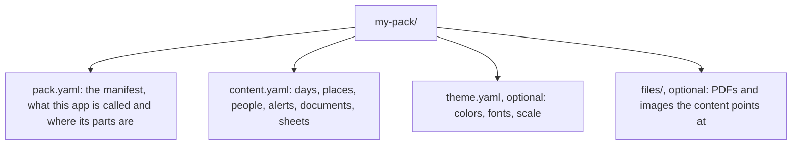

# Pack format

A pack is a folder. The shell loads it, validates it, and becomes the app it describes.



Two rules before the keys.

**Canonical keys are English; values are free.** The shell reads `days`, `blocks`, `places`,
`people`. What those keys hold can be in any language and any script, and the shell never parses
your prose: it places it. If your file already uses key names in another language, do not rewrite
it; declare a `keymap` in the manifest. The keymap is grouped by context (`day`, `option`, `place`,
`point`, `alert`, and so on), because the same canonical key has different names in different
places: `why` is `por_que` in an option and `por_que_importa` in a point.

**Unknown keys render, they do not break.** Any key the shell does not know becomes a card labelled
with the key name, underscores turned into spaces, holding its value. That is the feature that lets
you enrich a pack tonight and see it on the phone tomorrow without anyone writing code.

## pack.yaml

```yaml
pack:
  id: ruta-2027               # slug. Stable forever: calendar event ids derive from it
  name: Mi ruta               # what the app calls itself once this pack is loaded
  language: es                # BCP 47. Picks the shell's own handful of labels
  timezone: Europe/Lisbon     # IANA. The moment is computed in this zone
  content: content.yaml       # one file, or a list of files merged in order
  theme: theme.yaml           # optional. Without it the shell uses its default theme
  files: files/               # optional. Base for every file reference

conventions:                  # optional, all of it
  alert_prefixes: [warn, alert]   # keys starting with these render as an Alert, not a Card
  hidden_prefixes: [source]       # keys that carry provenance and never reach a screen

keymap:                       # optional. canonical key -> the name this pack uses, by context
  root:
    days: itinerario.dias     # under root, a dotted path is allowed
    places: lugares
    people: viajeros
  day: {date: fecha, title: titulo, blocks: bloques, fixed: fijo_del_dia, options: opciones}
  point: {name: nombre, what: que_es, why: por_que_importa, for_kids: para_los_ninos}
  values:
    severity: {critical: critica, high: alta, medium: media, low: baja}

ui:                           # optional. overrides the shell's own labels
  today: Hoy
  back: Volver
  next: Lo que sigue
  open_map: Abrir en el mapa
```

## days

The spine of the pack. One entry per day, and inside it, blocks of time.

```yaml
days:
  - date: 2026-04-11                  # required, YYYY-MM-DD
    title: Arrival and the tile museum  # required
    who: [rita, tomas]                # optional, person ids
    sleeps_at: Casa da Graca          # optional, any free key is allowed here too
    blocks:
      - ["09:20", "Land at LIS T1. Passport queue, 45 to 90 min to clear."]
      - ["15:30", "The market by the river, closed on Mondays."]
      - ["", "Long flight behind you: nothing demanding."]
```

A block is a list: **time, text, and an optional map**. A block whose time is empty is a note about
the whole day: it shows up in the agenda and never becomes a screen of its own.

The third element is what turns a line of text into a real moment:

```yaml
      - ["11:15", "Museu Nacional do Azulejo, top floor first",
         {type: visit, place: azulejo, for: [rita, tomas]}]
      - ["18:40", "Ferry from Cais do Sodre",
         {type: transfer, place: cais_do_sodre, guide: tomas, locked: true}]
```

| key | what it does | if missing |
| --- | --- | --- |
| `type` | picks which cards the moment view builds | guessed from the text, and if that fails the moment is time plus text |
| `place` | id in `places`, where `during` and `parking` come from | the screen keeps the block's own text |
| `for` | person ids this block belongs to | everyone |
| `guide` | who is offered the chance to present this moment | nobody, and the kid screen does not appear |
| `until` | closes the moment before the next block starts | the next block closes it |
| `locked` | an hour that cannot move: a booked train, a timed entry | the hour is treated as soft |
| `language` | which branch of your phrase sheets applies here | no phrase sheet |

### The thirteen types

`visit`, `train`, `driving`, `walking`, `meal`, `event`, `flight`, `parking`, `lodging`, `night`,
`morning`, `transfer`, `free`. Thirteen values, not fourteen. Each one decides which cards the
moment view assembles and nothing else; the view itself never changes. Adding a type is a change to
the shell, so prefer an existing one plus your own free keys.

### A day with options

Some days are not one plan. A day can carry blocks that happen regardless and two or more closed
alternatives, and the shell keeps the choice on the device.

```yaml
  - date: 2026-04-12
    title: The coast or the hill town
    fixed:                                  # happen whatever gets chosen
      - ["08:30", "Pick up the car."]
      - ["20:00", "Dinner, both of you."]
    options:
      - id: coast
        name: The coast and an early arrival
        recommended: true
        cost: lunch and the parking
        why: three driving days follow; arriving early is what makes them work
        consequence: the hill town moves to the 15th
        blocks:
          - ["09:30", "Leave the city on the A5."]
      - id: hill_town
        name: The hill town
        cost: 24 EUR for the two funiculars
        blocks:
          - ["09:00", "Train from Rossio."]
    decision:
      when: 2026-04-09          # the night the app asks, once
      at: "21:00"
      decides: [2026-04-15]     # other days whose options depend on this answer
```

Rules the shell applies, and they are the whole feature:

- Until somebody chooses, the app behaves as the `recommended` option and says so in one line.
- `fixed` blocks are the only ones written to the calendar up front. The chosen option's blocks are
  written when it is chosen, and the previous option's events are removed. They are the only
  calendar events the app ever retracts.
- A day listed in `decides` filters its own options against the answer: an option whose `id`
  matches a `requires` on that day stays, the rest are dropped. Declare that with
  `requires: {date: 2026-04-12, option: hill_town}` on the dependent option.
- The choice lives on the device, never in the pack. The pack is a document, not a state file.

## places

```yaml
places:
  azulejo:
    name: Museu Nacional do Azulejo
    kind: museum                      # free prose. Never used to choose a view
    at: {lat: 38.7248, lon: -9.1139, radius_m: 120}   # optional, enables geofences
    safe: true                        # optional, a kid session may run here
    during:                           # the content of a moment at this place
      type: visit
      hours: "10:00 to 18:00, closed on Mondays"
      ticket: bookings.azulejo        # a path reference, resolved before the view sees it
      toilets: "Ground floor, past the shop"
      warn_bags: "Backpacks go in the lockers, 1 EUR coin, returned"
    parking:
      where: "On the street below the cloister"
      price: "[to confirm]"
      verified: 2026-03-02
    points:                           # ordered. The route is the order. May also sit inside during
      - id: panorama
        name: The great panorama
        what: "Twenty three metres of the city as it looked before the earthquake"
        why: "It is the only picture of the streets that are gone"
        for_kids: "Find the boat with three masts. There are four of them"
```

`points` is where kid mode earns its keep: in kid mode the sheet is **filtered**, not translated.
Only points with `for_kids` appear, and that text is what shows. A point without it is not a gap to
fill: there was nothing there to offer them.

`verified` never renders as a card. It is the date somebody checked the fact, and the screen uses it
for one thing: if the fact is older than a month, the card carries that date in small type.

## people

```yaml
people:
  - {id: rita,  name: Rita,  adult: true,  theme: rita}
  - {id: tomas, name: Tomas, adult: false, theme: tomas}
```

`adult` decides the mode, and it is not a setting anyone can flip. Who is holding the phone is
chosen once and changed on the handoff screen.

## alerts

The only source of the alert component in the whole app. Nothing is computed: alerts are read,
filtered by time and sorted by severity.

```yaml
alerts:
  - id: ferry_last_connection
    severity: critical               # critical | high | medium | low
    at: 2026-04-11T18:40             # when the thing happens. A date alone is fine
    time: "18:40"                    # optional, when at is only a date
    notify_from: 2026-04-11T17:30    # when it starts showing
    title: "The 19:10 ferry does not connect"
    detail: "It arrives after the last bus on the other side. Budget an hour."
    action: "Leave the museum cafe by 18:10"
    see: bookings.azulejo            # optional path reference
```

| severity | where it shows |
| --- | --- |
| `critical` | above the answer, in the moment and in the agenda |
| `high` | below the moment's cards |
| `medium` | a row in the day's agenda, not in the moment |
| `low` | only in the alerts sheet |

## documents

Files that have to open with no signal, because somebody at a counter is asking for them.

```yaml
documents:
  - id: insurance_rita
    title: Travel insurance
    for: rita                        # person id. One card per person
    file: files/insurance-rita.pdf
    fields:
      Certificate: "PT-2210554"
      Cover: "20,000 EUR medical, repatriation included"
      Call: "[to confirm]"
      Valid: "6 h before departure until 6 h after the return flight"
```

The shell renders one card per document, groups them by `for`, opens the file full screen at maximum
brightness, and never needs the network to do it.

## sheets

Everything else. Any tree under `sheets` becomes a sheet: a title, a back link to the moment that
opened it, and rows or cards. This is where bookings, phrase lists, budgets, packing lists and
contacts live, and none of them needs shell support.

If there is no `sheets` key at all, **every root branch the shell does not know becomes a sheet**.
A pack that was already a tree of your own top level sections needs no rearranging for this: the
unknown key rule applies to the root as well.

```yaml
sheets:
  phrases:
    portuguese:
      - {there: "Dois bilhetes, por favor", here: "Two tickets, please", zone: Lisbon}
  bookings:
    - id: azulejo
      what: "Museum, one adult one child"
      code: "MNA-20418"
      when: 2026-04-11T11:15
```

## Path references

A value that looks like `bookings.azulejo` and resolves inside the pack is a reference; the
reader resolves it before any view sees it. If it does not resolve, it is text and shows as text.
The pattern is `^[a-z_][a-z0-9_]*(\.[a-z0-9_]+)+$`.

Resolution walks three shapes, because packs use all three:

- a map walks by key: `places.azulejo.parking.price`;
- a list of records walks by `id`: `bookings.azulejo` is the record whose `id` is that;
- `days` walks by `date`.

## The unknown key rule, exactly

Given a key the shell does not know, inside `during`, `parking`, a place, a day or a sheet:

1. If it starts with one of `conventions.hidden_prefixes`, it does not render at all.
2. If it starts with one of `conventions.alert_prefixes` (`warn`, `alert` by default), it renders as
   an Alert.
3. If its name ends in `__YYYY_MM_DD`, it renders only on that date, as an Alert. Use this for the
   note that matters on one day and is noise on the other twelve.
4. Otherwise it renders as a Card whose label is the key with underscores turned into spaces, and
   whose body is the value. A list becomes rows; a map becomes a small sheet.

`[to confirm]` anywhere in a value renders as a striped hole with the words inside. A missing price
shows as missing on purpose: an invented one is worse than a hole.
